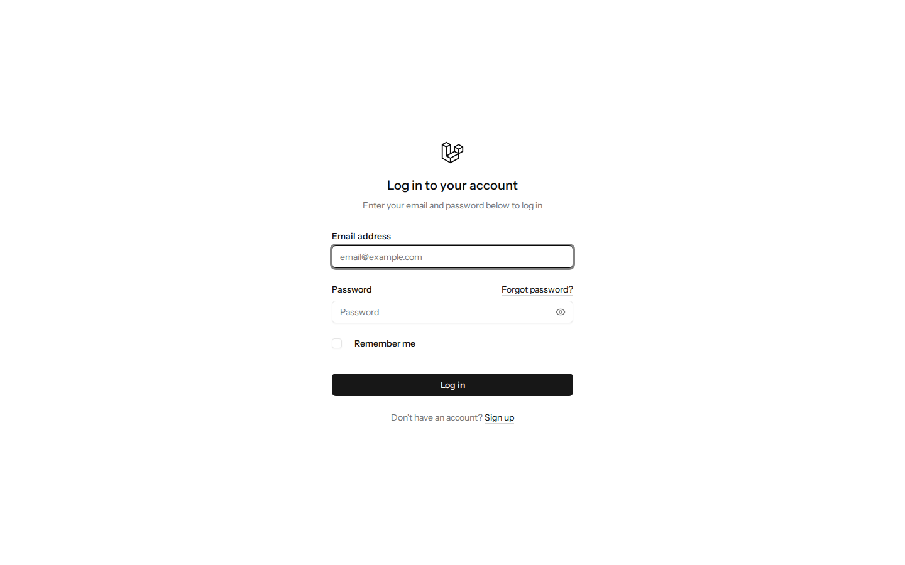
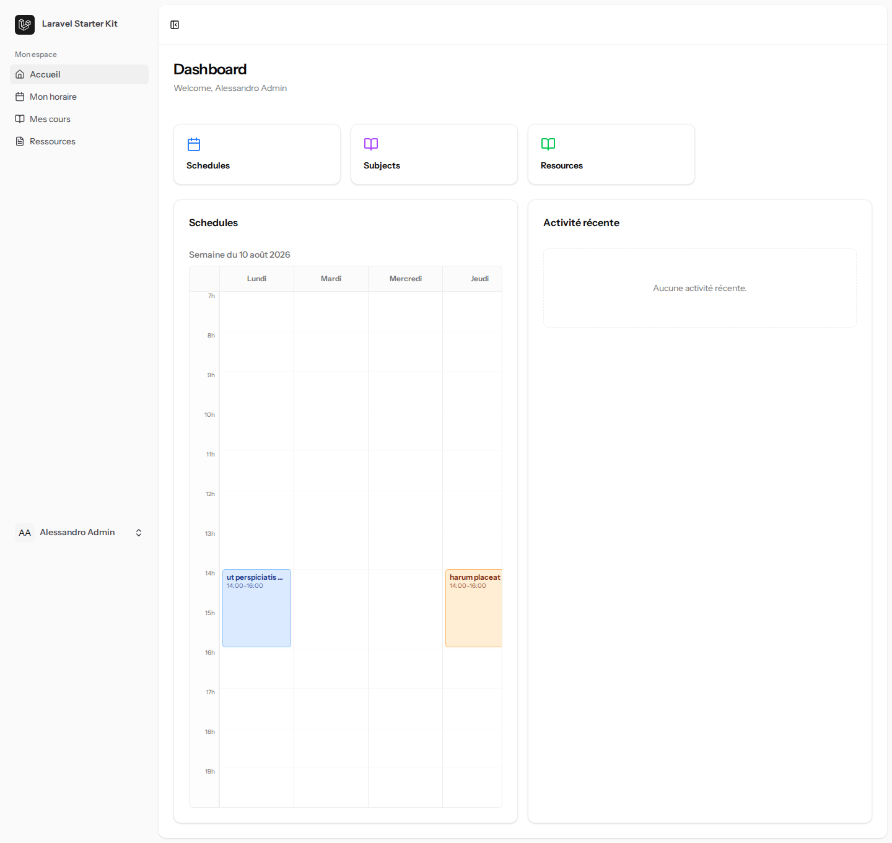
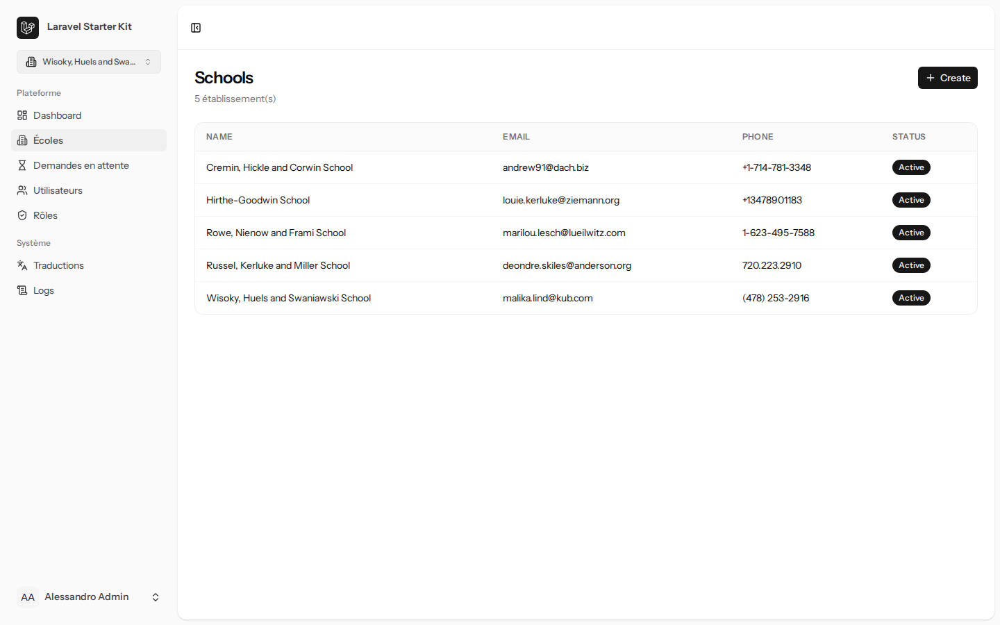
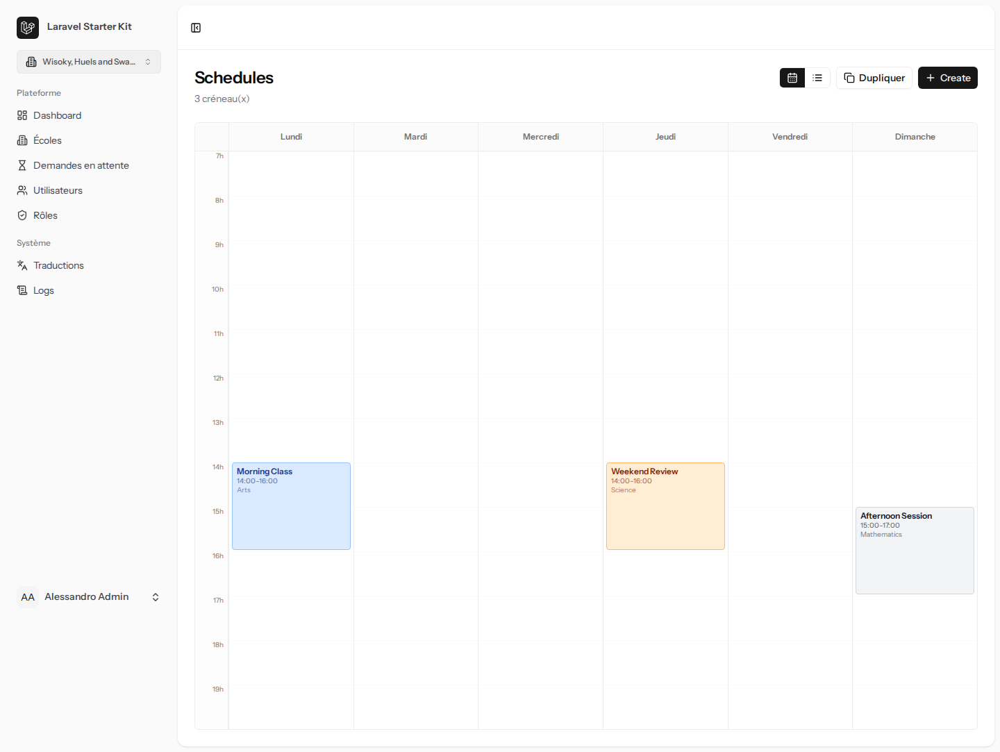
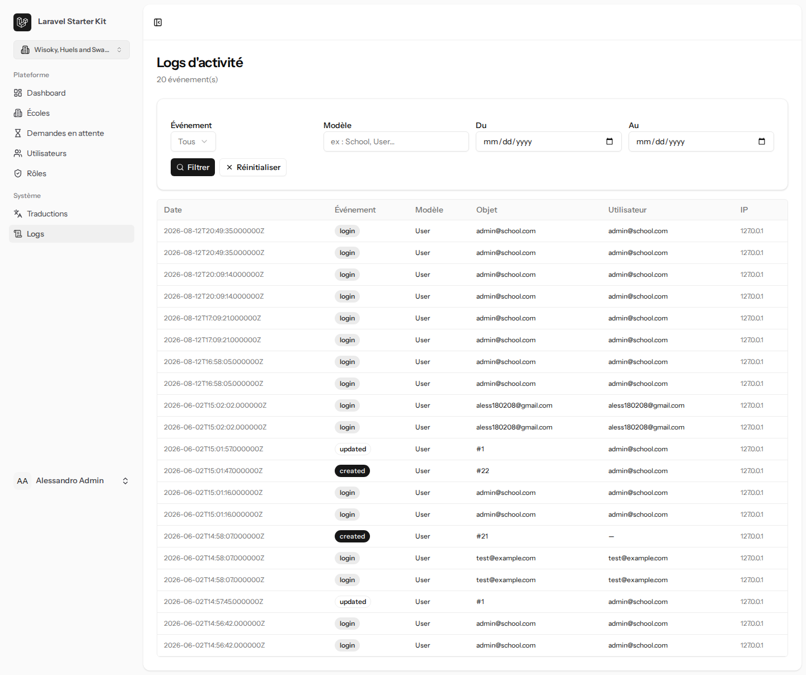

# School App — Présentation du projet

> Dépôt : `aless-guisset/SCHOOL_APP` · Document généré le 2026-08-12 à partir du code, des specs
> internes (`docs/superpowers/`) et de captures d'écran réelles de l'application en fonctionnement.

---

## 1. C'est quoi, en une phrase ?

**School App** est une plateforme web de gestion administrative pour établissements scolaires
(SaaS multi-écoles) : elle centralise les horaires de cours, les feuilles de présence des
professeurs, les inscriptions d'écoles, et l'accès différencié selon le rôle de chaque
utilisateur (administrateur de la plateforme, secrétariat, directeur, professeur, élève).

Une même installation peut héberger **plusieurs écoles indépendantes** ; chaque utilisateur peut
appartenir à plusieurs écoles avec un rôle différent dans chacune, et bascule entre elles via un
sélecteur d'école dans la barre latérale.

## 2. Le but du projet

D'après la feuille de route interne (`ROADMAP.md`) et la structure du code, l'objectif est de
remplacer la gestion papier/tableur d'un établissement (ou groupe d'établissements) par un outil
unique qui couvre :

- **L'inscription et l'approbation des écoles** sur la plateforme (une école soumet sa demande,
  un administrateur plateforme l'approuve ou la refuse).
- **La planification des cours** : sections de classe, matières, cours, créneaux horaires
  récurrents (« Schedule »), avec détection automatique des conflits (salle déjà prise, professeur
  déjà occupé).
- **Le suivi réel des heures** : chaque créneau planifié peut être « acquitté » par une feuille de
  temps (« Timesheet ») qui enregistre concrètement qui a fait cours, dans quelle salle, sur
  quelle matière, à quelle date.
- **La traçabilité** : un journal d'activité (« Logs ») enregistre les créations/modifications/
  suppressions sur les principaux modèles métier, consultable par l'administrateur.
- **Un accès strictement cloisonné par rôle et par école** : un professeur ne voit que ses propres
  créneaux, un élève ne voit que ceux de sa section, une école ne voit jamais les données d'une
  autre école.

## 3. Comment ça fonctionne (parcours utilisateur)

1. Un visiteur crée un compte, puis soit rejoint une école existante soit soumet la création
   d'une nouvelle école (mise en attente d'approbation par un administrateur plateforme).
2. Une fois rattaché à une école avec un rôle, l'utilisateur arrive sur son **Dashboard**, qui
   s'adapte automatiquement à son rôle : un administrateur voit les statistiques globales de la
   plateforme, un professeur voit son planning de la semaine, un élève voit uniquement les
   créneaux de sa section.
3. Le **secrétariat / power user** planifie les créneaux (`Schedules`), assigne les sections aux
   cours, gère les salles et les ressources pédagogiques.
4. Les **professeurs** consultent leur horaire et, via les feuilles de temps, confirment les
   séances réellement données.
5. Toute action de création/modification/suppression sur les entités métier est journalisée dans
   les **Logs d'activité**, visibles par les rôles de gestion.

### Rôles et ce que chacun voit dans la barre latérale

| Rôle | Portée | Accès principal |
|---|---|---|
| **Administrateur** | Toute la plateforme | Écoles, demandes en attente, utilisateurs, rôles, traductions, logs |
| **Directeur** | Une école | Utilisateurs, sections, cours, horaires |
| **Power User** | Une école (secrétariat étendu) | Utilisateurs, sections, cours, matières, horaires, feuilles de temps, salles, ressources |
| **Secrétariat** | Une école | Utilisateurs, horaires, feuilles de temps |
| **Professeur** | Ses propres cours | Son horaire, ses feuilles de temps, ses sections, ressources |
| **Élève** | Sa section | Son horaire, ses cours, ressources |

## 4. Captures d'écran (application réelle, connectée en tant qu'Administrateur)

### Page de connexion


### Dashboard — vue d'ensemble adaptée au rôle
Widget « Horaire de la semaine » (calendrier scopé par rôle, avec libellé de la semaine en cours)
et widget « Activité récente » (visible seulement pour les rôles de gestion).


### Gestion des écoles (vue Administrateur plateforme)


### Planification des horaires (vue calendrier hebdomadaire)


### Journal d'activité


## 5. État d'avancement

D'après `ROADMAP.md` à la date de ce document :

**Fait / complété :**
- Middleware multi-écoles, flux de connexion, sidebar dynamique par rôle
- Controllers Inertia, traductions en base de données, Dashboard, CRUD de base
- Approbation des écoles, détection de conflits d'horaire
- CRUD complet (utilisateurs, salles, ressources, matières, cours, feuilles de temps)
- Journal d'activité sur 12 modèles + duplication de planning
- **Widgets Dashboard (calendrier semaine + activité récente)** — dernière fonctionnalité livrée

**En cours / prévu :**
- Calendrier des feuilles de temps avec assistant en 4 étapes
- CRUD complet des traductions (actuellement, le lien « Traductions » du menu admin pointe vers
  une page pas encore branchée côté backend — 404 connu, pas un bug de cette session)
- Notification à l'administrateur lors de la soumission d'une nouvelle école
- Tests automatisés plus complets, version mobile, module de présence, module de communication,
  export RGPD

## 6. Points d'attention connus (sécurité / dette technique)

- La page de détail d'un horaire (`/schedules/{id}`) n'a pas encore de contrôle d'autorisation
  strict côté serveur — un correctif partiel a été appliqué côté Dashboard (les liens ne sont
  affichés qu'aux rôles de gestion), mais une revue complète de cette route reste à faire.
- Le lien « Traductions » du menu administrateur mène à une route non encore implémentée.

---

## 7. Explication simplifiée du code (pour un non-développeur ou un développeur junior)

### La recette en résumé

Le projet suit une recette assez classique pour une application web moderne : un **serveur**
(PHP/Laravel) qui parle à une **base de données** (MySQL) et qui envoie des **pages** à
l'utilisateur, ces pages étant construites avec des **composants** réutilisables
(Vue.js) plutôt que du HTML figé.

```
Navigateur (utilisateur)
      │
      ▼
  Vue.js (l'affichage, les boutons, les formulaires)
      │  ── Inertia.js fait le pont, sans passer par une API séparée ──
      ▼
  Laravel (la logique métier : qui a le droit de voir/faire quoi)
      │
      ▼
  MySQL (où sont stockées les écoles, les horaires, les utilisateurs...)
```

### Les briques principales

- **Les « Models »** (`app/Models/`) : chaque fichier représente une chose que l'application
  connaît — une `School` (école), un `Schedule` (créneau horaire), un `Timesheet` (feuille de
  temps), un `User` (utilisateur)... Un Model, c'est la traduction en code d'une ligne dans une
  table de la base de données.

- **Les « Controllers »** (`app/Http/Controllers/`) : ce sont les chefs d'orchestre. Quand
  l'utilisateur clique sur « Voir mes horaires », c'est un Controller qui reçoit la demande, va
  chercher les bonnes données dans la base (en filtrant selon qui pose la question — c'est là
  qu'on empêche un élève de voir les données d'une autre école), et renvoie une page prête à
  afficher.

- **Les pages Vue** (`resources/js/pages/`) : c'est ce que l'utilisateur voit réellement à
  l'écran, organisé par rôle (`admin/`, `power-user/`, etc.) et par entité (`Schedules/`,
  `Users/`...). Chaque page a en général quatre variantes : lister (`Index`), créer (`Create`),
  modifier (`Edit`), voir le détail (`Show`).

- **Les composants réutilisables** (`resources/js/components/`) : des morceaux d'interface
  utilisés à plusieurs endroits — par exemple `WeeklyCalendar.vue`, la grille de calendrier
  hebdomadaire qui sert à la fois pour les horaires et pour le dashboard, pour ne pas réécrire
  deux fois le même calendrier.

- **Les « Observers »** (`app/Observers/`) : du code qui « écoute en silence ». Dès qu'une école,
  un cours ou une feuille de temps est créé/modifié/supprimé, l'observer d'activité en garde une
  trace automatiquement dans le journal — sans que chaque Controller ait besoin d'y penser.

- **Les migrations** (`database/migrations/`) : l'historique, fichier par fichier, de la
  structure de la base de données. Chaque migration ajoute ou modifie une table. C'est ce qui
  permet de reconstruire la base de zéro, ou de la faire évoluer sans tout casser.

### Une image pour comprendre le cloisonnement par rôle

Le point le plus important du projet, techniquement, est que **la sécurité ne se fait jamais dans
l'affichage** (le Vue.js), mais toujours côté serveur (Laravel), avant même que la donnée ne
quitte la base. Concrètement : quand un élève demande son horaire, le Controller ne dit pas
« affiche tout et cache ce qui n'est pas à lui » — il ne va **chercher en base que ce qui lui
appartient**. Même si quelqu'un essayait de tricher en modifiant la page dans son navigateur, il
n'aurait techniquement jamais accès aux données des autres.

### Comment une nouvelle fonctionnalité est construite ici

Le projet documente chaque fonctionnalité importante avant de l'écrire : un fichier « spec »
(le besoin, en langage clair) dans `docs/superpowers/specs/`, puis un fichier « plan » (les
étapes techniques précises, testées une à une) dans `docs/superpowers/plans/`. C'est ainsi que le
widget « Dashboard » présenté plus haut (calendrier de la semaine + activité récente) a été
construit et vérifié avant d'être fusionné dans le code principal.

---

*Ce document a été généré automatiquement à partir de l'état du code, des captures d'écran de
l'application en fonctionnement, et de la feuille de route interne du projet. Les sections
laissées sous forme de simple titre reflètent une information non disponible au moment de la
génération — à compléter manuellement si besoin.*

### Compléments à ajouter manuellement (information non disponible dans le code)

- Historique / contexte de création du projet
- Public cible précis et modèle économique (si applicable)
- Roadmap au-delà de ce qui figure dans `ROADMAP.md`
